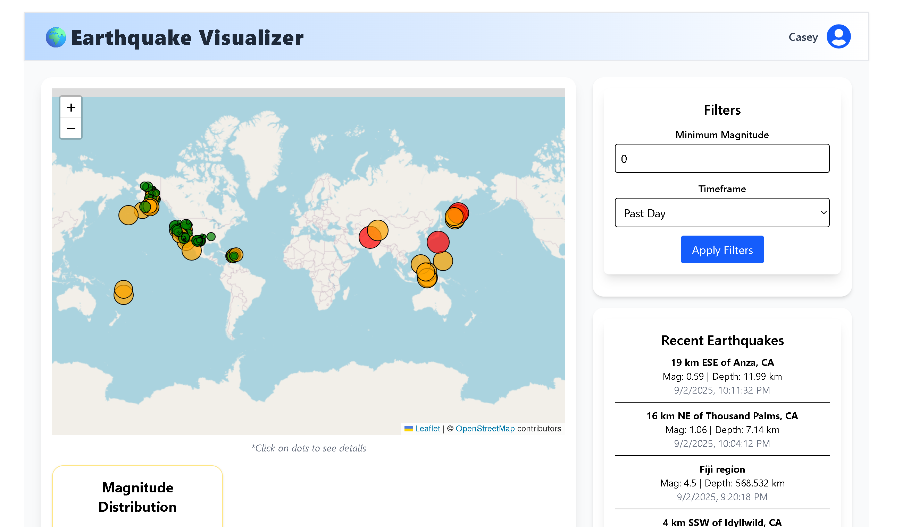
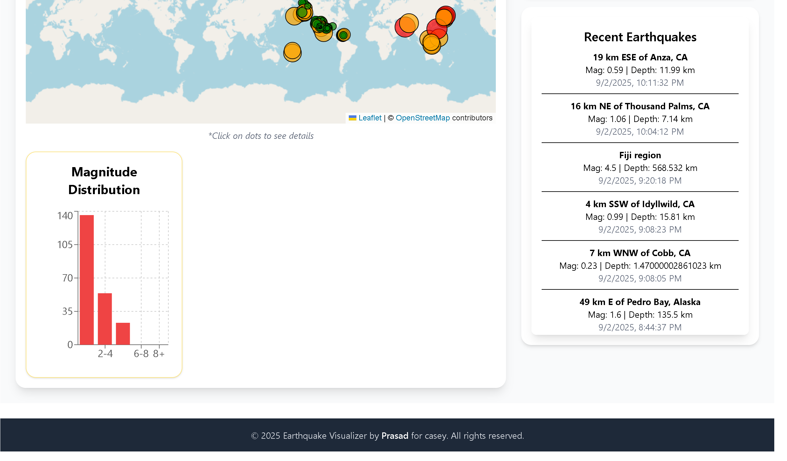

🌍 Earthquake Visualizer

📌 Overview

The Earthquake Visualizer is a React-based web application that fetches real-time earthquake data from the USGS Earthquake API
.
It provides an interactive map, charts, filters, and live earthquake feed to help users visualize seismic activity around the world.

🚀 Features

✅ Interactive map with earthquake markers (clickable for details)
✅ Real-time data from USGS GeoJSON API
✅ Filters by magnitude & timeframe
✅ Charts for data insights (magnitude distribution, frequency, etc.)
✅ Responsive UI with Tailwind CSS
✅ Dark / light inspired styling with a modern header & footer

## 🖼️ Screenshots  

### 🌍 Map View  
  

### 🎛️ Graph View 
 

🛠️ Tech Stack

⚛️ React (Vite) – Frontend

🎨 Tailwind CSS – Styling

🗺️ Leaflet.js – Maps

📊 Recharts – Charts & graphs

🌍 USGS API – Live earthquake data

⚡ Installation & Setup

Clone the repo

git clone 
cd earthquake-visualizer

Install dependencies

-->npm install
-->Run the project
-->npm run dev

Open in browser → 

📂 Project Structure
earthquake-visualizer/
│── public/          
│── src/
│   ├── components/
│   │   ├── MapView.jsx
│   │   ├── EarthquakeList.jsx
│   │   ├── Filters.jsx
│   │   ├── ChartsPanel.jsx
│   ├── App.jsx
│   ├── index.css
│   ├── main.jsx
│── package.json
│── README.md

🤝 Contributing

Contributions, issues, and feature requests are welcome!
Feel free to open a PR or raise an issue.

👨‍💻 Author

Prasad Babu Pulavarthi
📧 Email: pkrupavara@gmail.com

✨ If you like this project, don’t forget to star ⭐ the repo!